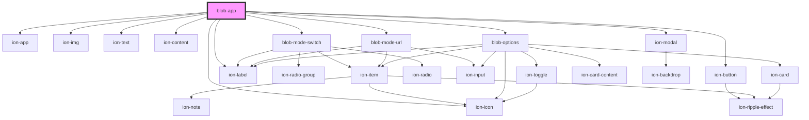

# blob-app

<!-- Auto Generated Below -->

## Dependencies

### Depends on

- ion-app
- ion-img
- ion-text
- ion-button
- ion-icon
- ion-content
- [blob-mode-switch](../blob-mode-switch)
- ion-label
- [blob-mode-url](../blob-mode-url)
- [blob-options](../blob-options)
- ion-modal

### Graph

----------------------------------------------

*Built with [StencilJS](https://stenciljs.com/)*
