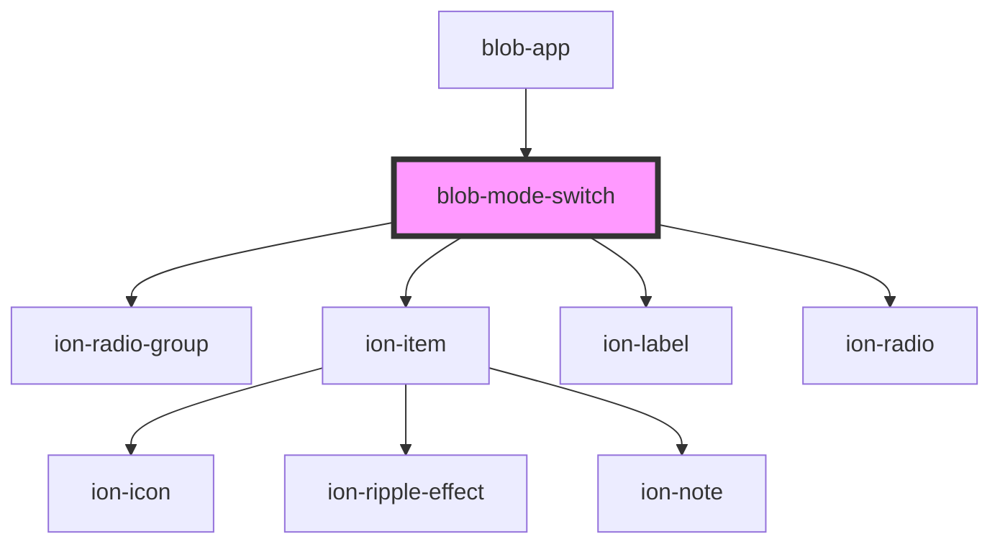

# blob-mode-switch

<!-- Auto Generated Below -->

## Events

| Event            | Description | Type                               |
| ---------------- | ----------- | ---------------------------------- |
| `blobModeSelect` |             | `CustomEvent<BlobModeEventDetail>` |

## Dependencies

### Used by

 - [blob-app](../blob-app)

### Depends on

- ion-radio-group
- ion-item
- ion-label
- ion-radio

### Graph

----------------------------------------------

*Built with [StencilJS](https://stenciljs.com/)*
