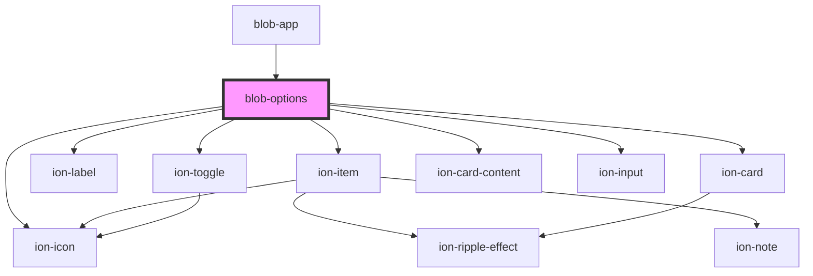

# blob-options

<!-- Auto Generated Below -->

## Dependencies

### Used by

 - [blob-app](../blob-app)

### Depends on

- ion-item
- ion-icon
- ion-label
- ion-toggle
- ion-card
- ion-card-content
- ion-input

### Graph

----------------------------------------------

*Built with [StencilJS](https://stenciljs.com/)*
