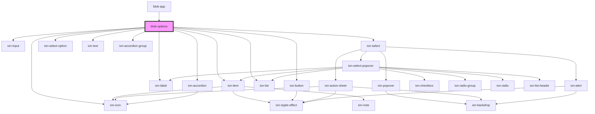

# blob-options

<!-- Auto Generated Below -->

## Methods

### `getArgs() => Promise<string[]>`

#### Returns

Type: `Promise<string[]>`

## Dependencies

### Used by

 - [blob-app](../blob-app)

### Depends on

- ion-item
- ion-label
- ion-input
- ion-icon
- ion-button
- ion-select
- ion-select-option
- ion-text
- ion-accordion-group
- ion-accordion
- ion-list

### Graph

----------------------------------------------

*Built with [StencilJS](https://stenciljs.com/)*
